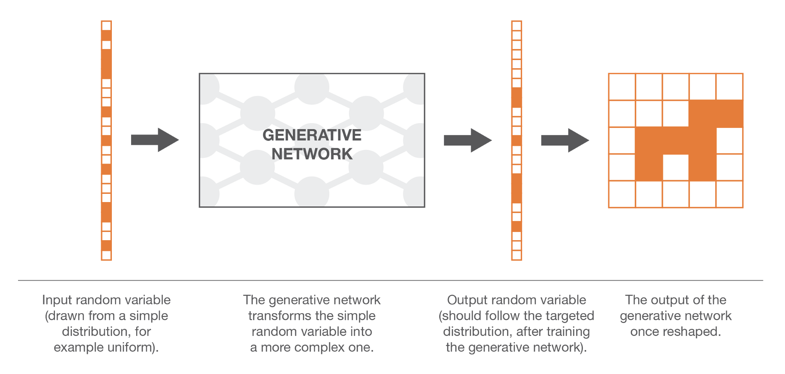
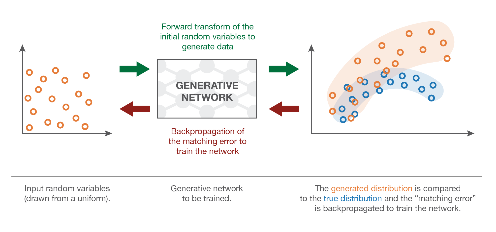

# Generative-Adversarial-Networks-GANs-

## Introduction
Yann LeCun described it as “the most interesting idea in the last 10 years in Machine Learning”. And, indeed, Generative Adversarial Networks (GANs for short) have had a huge success since they were introduced in 2014 by Ian J. Goodfellow and co-authors. 
Generative Adversarial Networks belong to the set of generative models. It means that they are able to produce / to generate new content. Naturally, this ability to generate new content makes GANs look a little bit “magic”, at least at first sight. 

## Generative models

We try to generate very complex random variables ... 

Suppose that we are interested in generating black and white square images of dogs with a size of n by n pixels. We can reshape each data as a N=nxn dimensional vector (by stacking columns on top of each others) such that an image of dog can then be represented by a vector. However, it doesn’t mean that all vectors represent a dog once shaped back to a square! So, we can say that the N dimensional vectors that effectively give something that look like a dog are distributed according to a very specific probability distribution over the entire N dimensional vector space (some points of that space are very likely to represent dogs whereas it is highly unlikely for some others). In the same spirit, there exists, over this N dimensional vector space, probability distributions for images of cats, birds and so on.

__Then, the problem of generating a new image of dog is equivalent to the problem of generating a new vector following the “dog probability distribution” over the N dimensional vector space. So we are, in fact, facing a problem of generating a random variable with respect to a specific probability distribution.__

 
 
## Generative Matching Networks

So our problem of generating a new image of dog can be rephrased into a problem of generating a random vector in the N dimensional vector space that follows the “dog probability distribution” and we have suggested to use a transform method, with a neural network to model the transform function. 
Now, we still need to train (optimise) the network to express the right transform function. For this there can be two different training methods: a direct one and an indirect one. The direct training method consists in comparing the true and the generated probability distributions and backpropagating the difference (the error) through the network. This is the idea that rules Generative Matching Networks (GMNs). For the indirect training method, we do not directly compare the true and generated distributions. Instead, we train the generative network by making these two distributions go through a downstream task chosen such that the optimisation process of the generative network with respect to the downstream task will enforce the generated distribution to be close to the true distribution. This last idea is the one behind Generative Adversarial Networks (GANs). 

## Backpropagation of the distribution matching error

So, once we have defined a way to compare two distributions based on samples, we can define the training process of the generative network in GMNs. Given a random variable with uniform probability distribution as input, we want the probability distribution of the generated output to be the “dog probability distribution”. The idea of GMNs is then to optimise the network by repeating the following steps:

* generate some uniform inputs
* make these inputs go through the network and collect the generated outputs
* compare the true “dog probability distribution” and the generated one based on the available samples (for example compute the MMD distance between the sample of true dog images and the sample of generated ones)
* use backpropagation to make one step of gradient descent to lower the distance (for example MMD) between true and generated distributions

 
 
__When following these steps we are applying a gradient descent over the network with a loss function that is the distance between the true and the generated distributions at the current iteration.__

# Generative Adversarial Networks

### The “indirect” training method

The “direct” approach presented above compare directly the generated distribution to the true one when training the generative network. The brilliant idea that rules GANs consists in replacing this direct comparison by an indirect one that takes the form of a downstream task over these two distributions. The training of the generative network is then done with respect to this task such that it forces the generated distribution to get closer and closer to the true distribution.
\n
The downstream task of GANs is a discrimination task between true and generated samples. Or we could say a “non-discrimination” task as we want the discrimination to fail as much as possible. So, in a GAN architecture, we have a discriminator, that takes samples of true and generated data and that try to classify them as well as possible, and a generator that is trained to fool the discriminator as much as possible.

### The ideal case: perfect generator and discriminator

We assume for now that this discriminator is a kind of oracle that knows exactly what are the true and generated distribution and that is able, based on this information, to predict a class (“true” or “generated”) for any given point. If the two distributions are far appart, the discriminator will be able to classify easily and with a high level of confidence most of the points we present to it. If we want to fool the discriminator, we have to bring the generated distribution close to the true one. The discriminator will have the most difficulty to predict the class when the two distributions will be equal in all points: in this case, for each point there are equal chances for it to be “true” or “generated” and then the discriminator can’t do better than being true in one case out of two in average.

 
 
At this point, it seems legit to wonder whether this indirect method is really a good idea. Indeed, it seems to be more complicated (we have to optimise the generator based on a downstream task instead of directly based on the distributions) and it requires a discriminator that we consider here as a given oracle but that is, in reality, neither known nor perfect. For the first point, the difficulty of directly comparing two probability distributions based on samples counterbalances the apparent higher complexity of indirect method. For the second point, it is obvious that the discriminator is not known. However, it can be learned! 

### The approximation: adversarial neural networks

Let’s now describe the specific form that take the generator and the discriminator in the GANs architecture. The generator is a neural network that models a transform function. It takes as input a simple random variable and must return, once trained, a random variable that follows the targeted distribution. As it is very complicated and unknown, we decide to model the discriminator with another neural network. This neural network models a discriminative function. It takes as input a point (in our dog example a N dimensional vector) and returns as output the probability of this point to be a “true” one.
Once defined, the two networks can then be trained jointly (at the same time) with opposite goals :

* the goal of the generator is to fool the discriminator, so the generative neural network is trained to maximise the final classification error (between true and generated data).
* the goal of the discriminator is to detect fake generated data, so the discriminative neural network is trained to minimise the final classification error.

 

__So, at each iteration of the training process, the weights of the generative network are updated in order to increase the classification error (error gradient ascent over the generator’s parameters) whereas the weights of the discriminative network are updated so that to decrease this error (error gradient descent over the discriminator’s parameters).__

_These opposite goals and the implied notion of adversarial training of the two networks explains the name of “adversarial networks”: both networks try to beat each other and, doing so, they are both becoming better and better. The competition between them makes these two networks “progress” with respect to their respective goals.From a game theory point of view, we can think of this setting as a **minimax two-players game** where the equilibrium state corresponds to the situation where the generator produces data from the exact targeted distribution and where the discriminator predicts “true” or “generated” with probability 1/2 for any point it receives._

